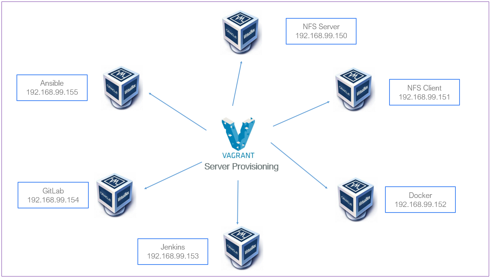
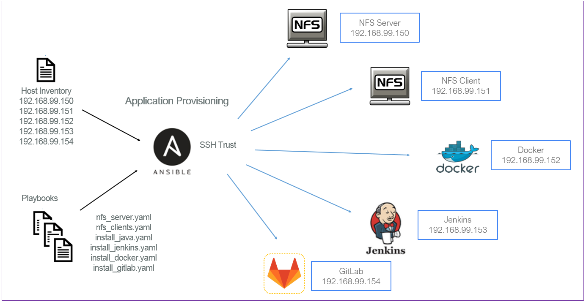
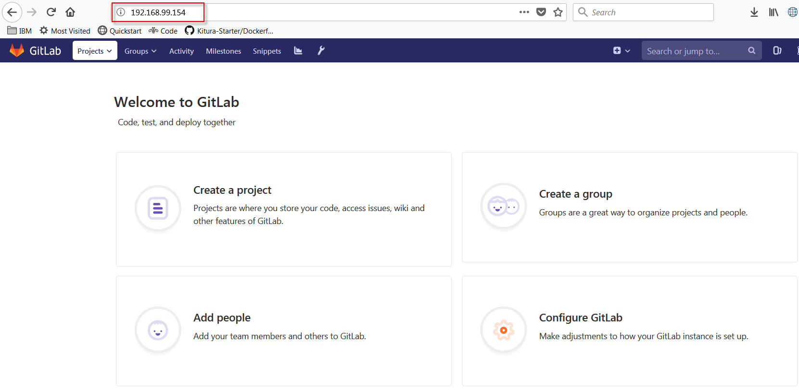
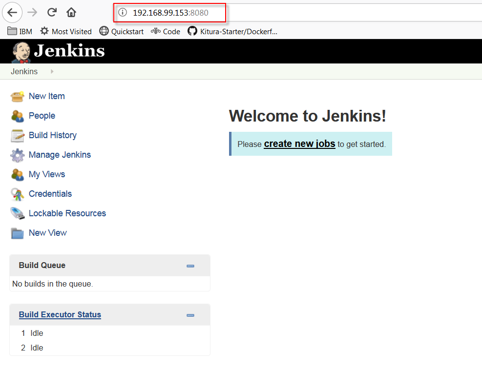
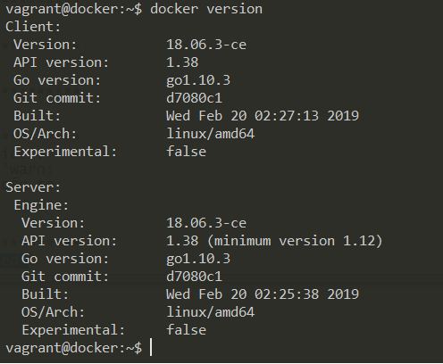

# End-to-end automated environment with Vagrant, Ansible, Docker, Jenkins, and GitLab.

Ansible is a beautifully simple agentless (and serverless) **Configuration Management** (CM) tool for configuration management, provisioning, and deployment. Its strength is the agentless nature that makes it simple and powerful. Configuration Management refers to the process of systematically handling changes to a system in a way that it maintains integrity over time, also known as idempotent. Like most of the Idempotent Infrastructure tools (no matter how many times you call the operation, the result will be the same, unless a change needs to be made.), it provides the ability through declarative language to describe system configuration; Ansible uses YAML (YAML Ain't Markup Language) is a human-readable data serialization language syntax for expressing **Ansible Playbooks**. Ansible Playbooks are the building blocks for all the use cases of Ansible. The different YAML tags are classified into four types knows as declaration, vars, tasks, and handlers; through this article, we will take a practical approach in describing each one.

## Getting Started
This step-by-step demo gives you a walkthrough on how to build a CI **(Continuous Integration)** environment with minimal effort; all the steps come together to you in the form of a use case solving a specific issue with a development environment. Apart from installing Vagrant and VirtualBox everything else is automated using Ansible Playbooks; we will go over six playbooks, each one solves a specific problem in the automation. The code is provided for you to put the demo to the test; each section builds from the previous one; it's best that we follow the documentation systematically. Thus, I have that expectation that you will leverage the **Git** repository and follow along; so that a build goes well from start to end.

Many of the Ansible notions from Inventory, Playbooks, Modules, Variables, Conditionals, and Loops are covered. I have intentionally not used Roles; this is probably going to be used on a future article, as this can be somewhat complicated and overwhelming trying to pack too many concepts on the first article.

This real-life scenario will address:
- **Provisioning servers with Vagrant and VirtualBox.**
- **Provisioning applications with Ansible Playbooks and Host Inventory file.**
- **Continuous Integration with GitLab, Jenkins, and Docker.**

## Prerequisites
To follow along you are required to have these programs in place:
-  [Vagrant](https://www.vagrantup.com/downloads.html): download the proper package for your operating system and architecture. 
-  [VirtualBox](https://www.virtualbox.org/wiki/Downloads): by downloading, you agree to the terms and conditions of the respective license. 

This article will use **ubuntu/trusty64** image with version **20180404.0.0**; feel free to choose your own Box by visiting [Vagrantbox.es](http://www.vagrantbox.es/)

## Provisioning Servers with Vagrant and VirtualBox

We are starting with a customized configuration file for this walkthrough. The end-to-end provisioning time is in the order of 75-90 minutes depending on our your available resource, most of the time is spent provisioning GitLab, not sure why but half of it is consumed installing the server.

The configuration file can be found at ./artefacts/config/config_multi-nodes.yaml


**FIGURE 1: Server Provisioning with Vagrant and VirtualBox.**


### Vagrant configuration file
File location: ./artefacts/config/config_multi-nodes.yaml

``` yaml
vagrant_box: ubuntu/trusty64
vagrant_box_version: "20180404.0.0"
vagrant_ip: 192.168.99.
vagrant_hostname: vagrant
vagrant_memory: 4096
vagrant_directory: /vagrant
vagrant_cpu: 2
vagrant_box_check_update: false
vagrant_domain_name: sample.com

```


## Building the servers with Vagrantfile

The heavy lifting happens in the Vagrantfile section, with six images to build and shared directory.
- NFS Server
- NFS Client
- Docker
- Jenkins
- GitLab
- Ansible

File location:  ./Vagrantfile

``` ruby
# -*- mode: ruby -*-
# vi: set ft=ruby :
# Use config.yaml for basic VM configuration.

require 'yaml'
dir = File.dirname(File.expand_path(__FILE__))
config_nodes = "#{dir}/artefacts/config/config_multi-nodes.yaml"

if !File.exist?("#{config_nodes}")
  raise 'Configuration file is missing! Please make sure that the configuration exists and try again.'
end
vconfig = YAML::load_file("#{config_nodes}")

BRIDGE_NET = vconfig['vagrant_ip']
DOMAIN = vconfig['vagrant_domain_name']
RAM = vconfig['vagrant_memory']

servers=[
  {
    :hostname => "nfsserver." + "#{DOMAIN}",
    :ip => "#{BRIDGE_NET}" + "150",
    :ram => 1024
  },
  {
    :hostname => "nfsclient." + "#{DOMAIN}",
    :ip => "#{BRIDGE_NET}" + "151",
    :ram => 1024
  },
  {
    :hostname => "docker." + "#{DOMAIN}",
    :ip => "#{BRIDGE_NET}" + "152",
    :ram => 2048 
  },
  {
    :hostname => "jenkins." + "#{DOMAIN}",
    :ip => "#{BRIDGE_NET}" + "153",
    :ram => "#{RAM}" 
  },
  {
    :hostname => "gitlab." + "#{DOMAIN}",
    :ip => "#{BRIDGE_NET}" + "154",
    :ram => "#{RAM}" 
  },
  {
    :hostname => "ansible." + "#{DOMAIN}",
    :ip => "#{BRIDGE_NET}" + "155",
    :ram => "#{RAM}",
	:install_ansible => "./artefacts/scripts/install_ansible.sh", 
	:config_ansible => "./artefacts/scripts/config_ansible.sh",
	:source =>  "./artefacts/.",
	:destination => "/home/vagrant/"
  }
]
 
Vagrant.configure(2) do |config|
    config.vm.synced_folder ".", vconfig['vagrant_directory'], :mount_options => ["dmode=777", "fmode=666"]
    servers.each do |machine|
        config.vm.define machine[:hostname] do |node|
			node.vm.box = vconfig['vagrant_box']
			node.vm.box_version = vconfig['vagrant_box_version']
			node.vm.hostname = machine[:hostname]
            node.vm.network "private_network", ip: machine[:ip] 
            node.vm.provider "virtualbox" do |vb|
                vb.customize ["modifyvm", :id, "--natdnshostresolver1", "on"]
				vb.cpus = vconfig['vagrant_cpu']
				vb.memory = machine[:ram]
                vb.name = machine[:hostname]
                if (!machine[:install_ansible].nil?)
                  if File.exist?(machine[:install_ansible])
					node.vm.provision :shell, path: machine[:install_ansible]
                  end
                  if File.exist?(machine[:config_ansible])
					node.vm.provision :file, source: machine[:source] , destination: machine[:destination]
      			    node.vm.provision :shell, privileged: false, path: machine[:config_ansible]
                  end
                end
            end
        end
    end
end

```
## Install Ansible repository
The ./artefacts/scripts/install_ansible.sh contains all the required instructions to:
- Install Ansible repository
- Install Ansible
- Install expect, dos2unix & tree
- Adjust timezone to be Singapore
- Add vagrant user to sudoers
- Generating SSH key password configuration on ansible server to later access remote servers


``` sh
#!/bin/sh

# Install Ansible repository.
apt -y update && apt-get -y upgrade
apt-get install software-properties-common
apt-add-repository ppa:ansible/ansible -y

# Install Ansible.
apt-get update
apt-get install ansible -y

# Install expect, dos2unix & tree
apt-get install expect -y 
apt-get install dos2unix -y
apt-get install tree -y 

# Cleanup unneded packages
apt-get -y autoremove

# Adjust timezone to be Singapore
ln -sf /usr/share/zoneinfo/Asia/Singapore /etc/localtime

# Add vagrant user to sudoers.
echo "vagrant        ALL=(ALL)       NOPASSWD: ALL" >> /etc/sudoers
sed -i "s/^.*requiretty/#Defaults requiretty/" /etc/sudoers

# Disable daily apt unattended updates.
#echo 'APT::Periodic::Enable "0";' >> /etc/apt/apt.conf.d/10periodic

# generating password configuration on ansible server to later access remote servers
echo vagrant | sudo -S su - vagrant -c "ssh-keygen -t rsa -f /home/vagrant/.ssh/id_rsa -q -P ''"
```


## Provision applications with Ansible Playbooks and Host Inventory file 

The playbook is the core component of any Ansible configuration. Each Ansible playbook contains one or multiple plays, which defines the work to be done for a configuration on a managed server. Ansible plays are written in YAML, as mentioned in the introduction section. In addition to Playbooks, Ansible uses an **INI** file as inventory source, the INI file based inventory, sections are groups or group related with special : modifiers. An administrator creates each play with environment-specific parameters for the target machines; in our case, we have a total of six that will build, the **NFS server, NFS client, Docker, Java, Jenkins, and GitLab**.


**FIGURE 2: Application Provisioning with Ansible.**

This code uses Expect; expect is a program that automates interactions with applications that expose a text terminal interface. It should be noted that using passwords as command-line arguments, like in this example, is a huge security hole; you could use Vault or other programs to encrypt the password, we aim to make the demo simple and easy to use. Our disclaimer, this is not production ready grade.

File location: ./artefacts/scripts/ssh_pass.sh

``` sh
#!/usr/bin/expect -f

set host_user [lindex $argv 0]
set host_pass [lindex $argv 1]
set host_name [lindex $argv 2]

# no need for timeout 1
set timeout 60

spawn /usr/bin/ssh-copy-id -i /home/vagrant/.ssh/id_rsa.pub $host_user@$host_name
expect {
   "*yes/no*" { send "yes\r" ; exp_continue }
   "*assword:" { send "$host_pass\r" ; exp_continue }
   timeout { exit }
}

```
- Adding addresses to the /etc/hosts file
- Generating an SSH key
- Adding the server IPs to the hosts file
- Configuration of the INI file under /etc/ansible/hosts
- Transferring public key

Creating six PlayBooks; each playbook is self explanatory:
- ansible-playbook ~/artefacts/playbooks/nfs_server.yaml
- ansible-playbook ~/artefacts/playbooks/nfs_clients.yaml
- ansible-playbook ~/artefacts/playbooks/install_java.yaml
- ansible-playbook ~/artefacts/playbooks/install_jenkins.yaml
- ansible-playbook ~/artefacts/playbooks/install_docker.yaml
- ansible-playbook ~/artefacts/playbooks/install_gitlab.yaml

File location: ./artefacts/scripts/config_ansible.sh
``` bash
#!/bin/sh

USER=vagrant
PASSWORD=vagrant

# add addresses to /etc/hosts 
echo "192.168.99.155 ansible.sample.com" | sudo tee -a /etc/hosts 
echo "192.168.99.154 gitlab.sample.com" | sudo tee -a /etc/hosts 
echo "192.168.99.153 jenkins.sample.com" | sudo tee -a /etc/hosts 
echo "192.168.99.152 docker.sample.com" | sudo tee -a /etc/hosts 
echo "192.168.99.151 nfsclient.sample.com" | sudo tee -a /etc/hosts
echo "192.168.99.150 nfsserver.sample.com" | sudo tee -a /etc/hosts  

echo " " | sudo tee -a /etc/ansible/hosts
echo "[all]" | sudo tee -a /etc/ansible/hosts
echo "gitlab.sample.com" | sudo tee -a /etc/ansible/hosts 
echo "jenkins.sample.com" | sudo tee -a /etc/ansible/hosts 
echo "docker.sample.com" | sudo tee -a /etc/ansible/hosts 
echo "nfsclient.sample.com" | sudo tee -a /etc/ansible/hosts
echo "nfsserver.sample.com" | sudo tee -a /etc/ansible/hosts  

echo " " | sudo tee -a /etc/ansible/hosts
echo "[test]" | sudo tee -a /etc/ansible/hosts
echo "nfsserver.sample.com" | sudo tee -a /etc/ansible/hosts
echo "nfsclient.sample.com" | sudo tee -a /etc/ansible/hosts

echo " " | sudo tee -a /etc/ansible/hosts
echo "[nfs-server]" | sudo tee -a /etc/ansible/hosts
echo "nfsserver.sample.com" | sudo tee -a /etc/ansible/hosts

echo " " | sudo tee -a /etc/ansible/hosts
echo "[nfs-client]" | sudo tee -a /etc/ansible/hosts
echo "nfsclient.sample.com" | sudo tee -a /etc/ansible/hosts

echo " " | sudo tee -a /etc/ansible/hosts
echo "[jenkins]" | sudo tee -a /etc/ansible/hosts
echo "jenkins.sample.com" | sudo tee -a /etc/ansible/hosts

echo " " | sudo tee -a /etc/ansible/hosts
echo "[docker]" | sudo tee -a /etc/ansible/hosts
echo "docker.sample.com" | sudo tee -a /etc/ansible/hosts

echo " " | sudo tee -a /etc/ansible/hosts
echo "[gitlab]" | sudo tee -a /etc/ansible/hosts
echo "gitlab.sample.com" | sudo tee -a /etc/ansible/hosts

#cat /etc/ansible/hosts
dos2unix ~/artefacts/scripts/ssh_pass.sh
chmod +x ~/artefacts/scripts/ssh_pass.sh
#chown vagrant:vagrant ssh_pass.sh 

# password less authentication using expect scripting language
~/artefacts/scripts/ssh_pass.sh $USER $PASSWORD "ansible.sample.com" 
~/artefacts/scripts/ssh_pass.sh $USER $PASSWORD "nfsclient.sample.com" 
~/artefacts/scripts/ssh_pass.sh $USER $PASSWORD "nfsserver.sample.com" 
~/artefacts/scripts/ssh_pass.sh $USER $PASSWORD "docker.sample.com" 
~/artefacts/scripts/ssh_pass.sh $USER $PASSWORD "jenkins.sample.com"
~/artefacts/scripts/ssh_pass.sh $USER $PASSWORD "gitlab.sample.com"

ansible-playbook ~/artefacts/playbooks/nfs_server.yaml
ansible-playbook ~/artefacts/playbooks/nfs_clients.yaml
ansible-playbook ~/artefacts/playbooks/install_java.yaml
ansible-playbook ~/artefacts/playbooks/install_jenkins.yaml
ansible-playbook ~/artefacts/playbooks/install_docker.yaml
ansible-playbook ~/artefacts/playbooks/install_gitlab.yaml
```

#### Instructions:
- Installing NFS Server
- Create mountable dir
- Make sure the mount drive has a filesystem
- Set mountpoints
- Ensure NFS utilities are installed
- Copy /etc/exports
- Restart NFS server

File location: ./artefacts/playbooks/nfs_server.yaml

``` yaml
---
- name: Installing NFS Server 
  hosts: nfs-server
  become: true
  
  vars:
    mountable_share_drive: '/dev/sda1'   
    nfsexport: /share
  
  tasks:
    - name: Create mountable dir
      file: path={{ nfsexport }} state=directory mode=777 owner=root group=root
      tags: nfs-server
        
    - name: make sure the mount drive has a filesystem
      filesystem: fstype=ext4 dev={{ mountable_share_drive | default('/dev/sda1') }}
      tags: nfs-server
      
    - name: set mountpoints
      mount: name={{ nfsexport }} src={{ mountable_share_drive | default('/dev/sda1') }} fstype=auto opts=defaults,nobootwait dump=0 passno=2 state=mounted
      tags: nfs-server
      
    - name: Ensure NFS utilities are installed.
      apt: 
        name: ['nfs-common','nfs-kernel-server']  
        state: present 
        update_cache: yes
      tags: nfs-server
      
    - name: copy /etc/exports
      template: src=~/artifacts/templates/exports.j2 dest=/etc/exports owner=root group=root
      tags: nfs-server
      
    - name: restart nfs server
      service: name=nfs-kernel-server state=restarted
      tags: nfs-server
```
Jinja2  format 
File location: ./artefacts/templates/exports.j2
Ansible uses Jinja2 templating to enable dynamic expressions and access to variables as shown below:
``` jinja2
# /etc/exports: the access control list for filesystems which may be exported
#               to NFS clients.  See exports(5).
#
# Example for NFSv2 and NFSv3:
# /srv/homes       hostname1(rw,sync,no_subtree_check) hostname2(ro,sync,no_subtree_check)
#
# Example for NFSv4:
# /srv/nfs4        gss/krb5i(rw,sync,fsid=0,crossmnt,no_subtree_check)
# /srv/nfs4/homes  gss/krb5i(rw,sync,no_subtree_check)
#
{{ nfsexport }}           {{ hostvars[inventory_hostname]['facter_ipaddress_eth1'] }}/24(rw,sync,no_root_squash,no_subtree_check)

```

#### Instructions:
- Installing NFS Client
- Ensure NFS common is installed
- Create mountable dir
- Set mountpoints

File location: ./artefacts/playbooks/nfs_clients.yaml

``` yaml
---
- name: Installing NFS Client 
  hosts: nfs-clients
  become: true
  
  vars:
    nfsserver: 192.168.99.150
    nfs_mountpoint: /nfs
    nfsexport: /share

  tasks:
    - name: Ensure NFS common is installed.
      apt: name=nfs-common state=present update_cache=yes

    - name: Create mountable dir
      file: path={{ nfs_mountpoint }} state=directory mode=777 owner=root group=root

    - name: set mountpoints
      mount: name={{ nfs_mountpoint }} src={{ nfsserver }}:{{ nfsexport }} fstype=nfs opts=defaults,nobootwait dump=0 passno=2 state=mounted
```

#### Instructions:
- Install Oracle Java version 8
- Install dependencies
- Install add-apt-repostory
- Add Oracle Java Repository
- Add an apt key by id from a keyserver
- Accept Java 8 License
- Update cache and ignore errors in case of problems
- Purge java 8 installer - to avoid problems if installation is repeated
- Install Oracle Java 8

File location: ./artefacts/playbooks/install_java.yaml

``` yaml
---
- name: Install Oracle Java version 8
  hosts: jenkins
  become: true
  
  tasks:
  - name: Install dependencies
    become: yes
    apt:
      name: "{{ packages }}"  
    vars:
      packages:    
      - software-properties-common
      - dirmngr
      state: latest 
 
  - name: Install add-apt-repostory
    become: yes
    apt: name=software-properties-common state=latest
 
  - name: Add Oracle Java Repository
    become: yes
    apt_repository: 
      repo: deb http://ppa.launchpad.net/webupd8team/java/ubuntu trusty main
      state: present
 
  - name: Add an apt key by id from a keyserver
    become: yes
    apt_key:
      keyserver: keyserver.ubuntu.com
      id: EEA14886
 
  - name: Accept Java 8 License
    become: yes
    debconf: name='oracle-java8-installer' question='shared/accepted-oracle-license-v1-1' value='true' vtype='select'
 
  - name: update cache and ignore errors in case of problems
    become: yes
    apt: update_cache=yes
    ignore_errors: yes
 
  - name: purge java 8 installer - to avoid problems if installation is repeated
    become: yes
    apt: 
      name: oracle-java8-installer
      purge: yes
      state: absent
       
  - name: Install Oracle Java 8
    become: yes
    apt:
      name: "{{ packages }}"  
    vars:
      packages:    
      - ca-certificates
      - oracle-java8-installer
      - oracle-java8-set-default
      state: latest 
```

#### Instructions:
- Install Jenkins
- Ensure the jenkins apt repository key is installed
- Ensure the repository is configured
- Install Jenkins package
- Start & Enable Jenkins
- Sleep for 30 seconds and continue with play
- Get init password Jenkins
- Print init password Jenkins

File location: ./artefacts/playbooks/install_jenkins.yaml

``` yaml
---
- name: Install Jenkins
  hosts: jenkins
  gather_facts: false
  become: true
  
  tasks:
    - name: Ensure the jenkins apt repository key is installed
      apt_key: 
        url: https://pkg.jenkins.io/debian-stable/jenkins.io.key
        state: present

    - name: Ensure the repository is configured
      apt_repository: 
        repo: deb https://pkg.jenkins.io/debian-stable binary/ 
        state: present

    - name: Install Jenkins
      apt:
        name: jenkins
        state: present

    - name: Start & Enable Jenkins
      service: 
        name: jenkins
        state: started

    - name: Sleep for 30 seconds and continue with play
      wait_for: 
        timeout: 30

    - name: Get init password Jenkins
      shell: cat /var/lib/jenkins/secrets/initialAdminPassword
      changed_when: false
      register: result

    - name: Print init password Jenkins
      debug:
        var: result.stdout
```

#### Instructions:
- Install Docker
- Ensure old versions of Docker are not installed.
- Install list of packages
- APT - Add Docker GPG key
- Add Docker APT repository
- Install Docker CE
- Add vagrant to docker goup
- Restart Docker

File location: ./artefacts/playbooks/install_docker.yaml

``` yaml
---
- name: Install Docker
  hosts: docker
  become: true

  vars:
    ansible_distribution_release: trusty
    theuser: vagrant

  tasks:
  - name: Ensure old versions of Docker are not installed.
    package:
      name:
      - docker
      - docker-engine
      state: absent

  - name: Install list of packages
    package:
      name:    
      - apt-transport-https
      - ca-certificates
      - software-properties-common
      state: latest 
      update_cache: yes
      
  - name: APT - Add Docker GPG key
    apt_key: 
      keyserver: keyserver.ubuntu.com 
      id: 9DC858229FC7DD38854AE2D88D81803C0EBFCD88
      
  - name: Add Docker APT repository
    apt_repository:
      repo: deb [arch=amd64] https://download.docker.com/linux/ubuntu {{ ansible_distribution_release }} stable

  - name: Install Docker CE
    apt:
      name: docker-ce
      state: present
      update_cache: yes
      
  - name: add docker goup
    user:
      name: {{ theuser }}
      append: yes
      groups: docker
      
  handlers:
  - name: Restart Docker
    systemd:
      name: docker
      state: restarted
```

#### Instructions:
- Install GitLab
- Checking to make sure postfix is installed
- Install GitLab repository
- Run GitLab repository script
- Install GitLab CE
- Run ufw allow http script 
- Run ufw allow https script
- Run ufw allow OpenSSH script
- Restart with reconfigure
- GitLab Restart with restart
- GitLab gitlab-runsvdir status

File location: ./artefacts/playbooks/install_gitlab.yaml

``` yaml
---
- name: Install GitLab
  hosts: gitlab
  become: true

  tasks:
    - name: Checking to make sure postfix is installed
      apt:
        name:
        - postfix
        - mailutils
        - ca-certificates
        - curl 
        - openssh-server
        state: present
      tags: [postfix]
      when: ansible_os_family == 'Debian'        
    
    - name: Install GitLab repository
      get_url:
        url: https://packages.gitlab.com/install/repositories/gitlab/gitlab-ce/script.deb.sh
        dest: /tmp/script.deb.sh
        mode: 0777
    
    - name: Run GitLab repository script
      shell: /tmp/script.deb.sh

    - name: Install GitLab CE
      package:
        name:    
        - gitlab-ce
        state: latest 
        update_cache: yes
      
    - name: Run ufw allow http script 
      command: ufw allow http

    - name: Run ufw allow https script 
      command: ufw allow https

    - name: Run ufw allow OpenSSH script 
      command: ufw allow OpenSSH
      
    - name: Restart with reconfigure
      command: gitlab-ctl reconfigure

    - name: GitLab Restart with restart
      command: gitlab-ctl restart

    - name: GitLab gitlab-runsvdir status
      command: service gitlab-runsvdir status
```

## Continuous Integration with GitLab, Jenkins and Docker
A well implemented DevOps (development & operations) process should mean delivering better code at a faster pace.  We aimed to adopt a set of practices that automates the processes between software development and IT teams — using the available tool, such as Vagrant and VirtualBox for server provisioning and application adopting the likes of Ansible and finally embracing the development life cycle while delivering features with GitLab, Jenkins, and Docker for frequent release by fostering Continuous Integration.
- Developers check the code locally on their computers
- When completed — they commit changes to the repository
- Repository sends a request (webhook) to CI system
- CI server runs a job (tests, coverage, check syntax and others)
- CI server releases saved artifacts for testing
- If the build or tests fail, the CI server alerts the team
- The team fixes the issue with constant deploy and feedback mechanism in place.


**FIGURE 3: Continuous Integration with GitLab, Jenkins and Docker**


**FIGURE 4: GitLab configured for code**


**FIGURE 5: Jenkins Installed software**


**FIGURE 6: Current Docker version**

## Putting it all together

git clone https://github.com/ernesen/infra-ansible.git

```sh 
vagrant up --provider=virtualbox
```

``` log
Bringing machine 'nfsserver.sample.com' up with 'virtualbox' provider...
Bringing machine 'nfsclient.sample.com' up with 'virtualbox' provider...
Bringing machine 'docker.sample.com' up with 'virtualbox' provider...
Bringing machine 'jenkins.sample.com' up with 'virtualbox' provider...
Bringing machine 'gitlab.sample.com' up with 'virtualbox' provider...
Bringing machine 'ansible.sample.com' up with 'virtualbox' provider...
==> nfsserver.sample.com: Importing base box 'ubuntu/trusty64'...

[KProgress: 90%
[K==> nfsserver.sample.com: Matching MAC address for NAT networking...
==> nfsserver.sample.com: Checking if box 'ubuntu/trusty64' version '20180404.0.0' is up to date...
==> nfsserver.sample.com: Setting the name of the VM: nfsserver.sample.com
==> nfsserver.sample.com: Clearing any previously set forwarded ports...
==> nfsserver.sample.com: Vagrant has detected a configuration issue which exposes a
==> nfsserver.sample.com: vulnerability with the installed version of VirtualBox. The
==> nfsserver.sample.com: current guest is configured to use an E1000 NIC type for a
==> nfsserver.sample.com: network adapter which is vulnerable in this version of VirtualBox.
==> nfsserver.sample.com: Ensure the guest is trusted to use this configuration or update
==> nfsserver.sample.com: the NIC type using one of the methods below:
==> nfsserver.sample.com: 
==> nfsserver.sample.com:   https://www.vagrantup.com/docs/virtualbox/configuration.html#default-nic-type
==> nfsserver.sample.com:   https://www.vagrantup.com/docs/virtualbox/networking.html#virtualbox-nic-type
==> nfsserver.sample.com: Clearing any previously set network interfaces...
==> nfsserver.sample.com: Preparing network interfaces based on configuration...
    nfsserver.sample.com: Adapter 1: nat
    nfsserver.sample.com: Adapter 2: hostonly
==> nfsserver.sample.com: Forwarding ports...
    nfsserver.sample.com: 22 (guest) => 2222 (host) (adapter 1)
==> nfsserver.sample.com: Running 'pre-boot' VM customizations...
==> nfsserver.sample.com: Booting VM...
==> nfsserver.sample.com: Waiting for machine to boot. This may take a few minutes...
    nfsserver.sample.com: SSH address: 127.0.0.1:2222
    nfsserver.sample.com: SSH username: vagrant
    nfsserver.sample.com: SSH auth method: private key
    nfsserver.sample.com: Warning: Remote connection disconnect. Retrying...
    nfsserver.sample.com: Warning: Connection reset. Retrying...
    nfsserver.sample.com: 
    nfsserver.sample.com: Vagrant insecure key detected. Vagrant will automatically replace
    nfsserver.sample.com: this with a newly generated keypair for better security.
    nfsserver.sample.com: 
    nfsserver.sample.com: Inserting generated public key within guest...
==> nfsserver.sample.com: Machine booted and ready!
==> nfsserver.sample.com: Checking for guest additions in VM...
    nfsserver.sample.com: The guest additions on this VM do not match the installed version of
    nfsserver.sample.com: VirtualBox! In most cases this is fine, but in rare cases it can
    nfsserver.sample.com: prevent things such as shared folders from working properly. If you see
    nfsserver.sample.com: shared folder errors, please make sure the guest additions within the
    nfsserver.sample.com: virtual machine match the version of VirtualBox you have installed on
    nfsserver.sample.com: your host and reload your VM.
    nfsserver.sample.com: 
    nfsserver.sample.com: Guest Additions Version: 4.3.36
    nfsserver.sample.com: VirtualBox Version: 5.2
==> nfsserver.sample.com: [vagrant-hostsupdater] Checking for host entries
==> nfsserver.sample.com: [vagrant-hostsupdater] Writing the following entries to (C:/windows/system32/drivers/etc/hosts)
==> nfsserver.sample.com: [vagrant-hostsupdater]   192.168.99.150  nfsserver.sample.com  # VAGRANT: 89d7264420c8560cccab02598b0f211b (nfsserver.sample.com) / 26e57c02-65a7-4633-aa73-4c27c76dccbe
==> nfsserver.sample.com: [vagrant-hostsupdater] This operation requires administrative access. You may skip it by manually adding equivalent entries to the hosts file.
==> nfsserver.sample.com: Setting hostname...
==> nfsserver.sample.com: Configuring and enabling network interfaces...
```
## Conclusion
What got my attention was the fact that Ansible uses **SSH**, with no agents to install on remote systems. There are many possible ways to approach this. In my attempt to learn Ansible as a Configuration Management and automation tool for Infrastructure as Code **(IaC)**; along the way, I was able to showcase how to stand up new environments and apps in minutes. The time spent exploring the different facets of the tool and understanding its strengths and weakness in automating end-to-end environment were valuable to my learning. This article intended to show that building a **sandbox** is no longer a tedious task and anyone can and should try spinning one up as needed. 

#### References:
* [System administration and monitoring of Linux / Windows servers and video CDN](http://sysadm.pp.ua/linux/sistemy-virtualizacii/vagrantfile.html)
* [Gitlab installation with Ansible and Docker](https://www.djouxtech.net/posts/gitlab-installation-with-ansible-and-docker/)
* [Ansible template for automated GitLab server setup in Docker container](https://itsyndicate.org/blog/install-and-configure-gitlab-server-inside-docker/) 
* [How To Install and Configure GitLab on Ubuntu 18.04 ](https://www.digitalocean.com/community/tutorials/how-to-install-and-configure-gitlab-on-ubuntu-18-04)
* [How To Install Gitlab On Ubuntu 16.04](https://www.youtube.com/watch?v=0-y38nF2q08)
* [How to Install and Configure GitLab on Ubuntu 18.04 LTS](https://www.howtoforge.com/tutorial/how-to-install-and-configure-gitlab-on-ubuntu-1804/) 
* [How to Install and Configure GitLab CE on Ubuntu 18.04 / 16.04 Sever](https://www.linuxtechi.com/install-configure-gitlab-ce-ubuntu-18-04-16-04/)
* [Installing docker and docker-compose on remote server with Ansible](http://www.inanzzz.com/index.php/post/lvwk/installing-docker-and-docker-compose-on-remote-server-with-ansible)
* [Docker Tutorial 1: Docker Installation in Ubuntu 18.04](https://medium.com/@sh.tsang/installation-of-docker-3b18d9e70bea) 
* [Add docker gpg key using ansible](https://www.reddit.com/r/devops/comments/9pmd4n/add_docker_gpg_key_using_ansible/)
* [Install Oracle Java 8 / 9 in Ubuntu 16.04, Linux Mint 18](http://tipsonubuntu.com/2016/07/31/install-oracle-java-8-9-ubuntu-16-04-linux-mint-18/)
* [Ansible – install Oracle Java 8 on Debian / Ubuntu](http://clouds.freeideas.cz/subdom/clouds/2017/09/11/ansible-install-oracle-java-8-on-debian-ubuntu/) 
* [Installing docker and docker-compose on remote server with Ansible](http://www.inanzzz.com/index.php/post/lvwk/installing-docker-and-docker-compose-on-remote-server-with-ansible)
* [A minimal Docker Ansible role](https://ops.tips/blog/docker-ansible-role/)
